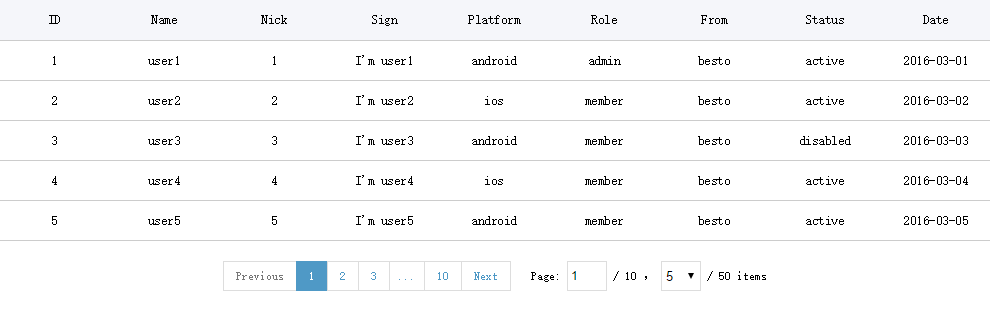

# vue-pagitable

> pagination & datatable component for Vue.js

# screenshot



# Requirements

- [Vue.js](https://github.com/yyx990803/vue) `^1.0.0`

- [vue-resource](https://github.com/pagekit/vue-resource) `^1.0.1` or whatever

# Usage

``` html
<template>
  <pagitable :total="total" @change-page="changePage"></pagitable>
  <pagitable :index="index" :size="size" :total="total" @change-page="changePage"></pagitable>
  <pagitable :index="index" :size="size" :total="total" :length="length" :options="options" @change-page="changePage"></pagitable>
</template>

<script>
  import Pagitable from 'path/to/pagitable.vue'

  export default {
    data() {
      return {
        index: 1,
        size: 5,
        total: 0,
        length: 5,
        options: [10, 20, 30],
        tableData: []
      }
    },
    components: {
      Pagitable
    },
    ready() {
      this.getUsers()
    },
    methods: {
      changePage(index, size) {
        this.index = index
        this.size = size
        this.getUsers()
      },
      getUsers() {
        // Get your data with this.index and this.size
        // Don't forget to update this.total
      }
    }
  }
</script>
```

# Run

1. Open your terminal.

2. Clone this repo:

  git clone https://github.com/AidenChen/vue-pagitable.git

3. Once finished, change directory to vue-pagitable:

  cd vue-pagitable

4. Install all dependencies:

  npm install

5. Run the demo:

  npm run dev

# License

[The MIT License](http://opensource.org/licenses/MIT)
